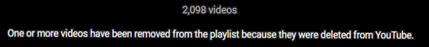

#Youtube playlist title scraper + deleted/prviate video finder.

##Intro

Do you have a youtube playlist that looks like this? 

Sick of the awful UI that doesn’t allow you to search through the titles?

Worst of all do the mean people at youtube not tell you what the title was so you can replace it?

Damn, guess you’ll never know what those videos were. Oh well..

### BUT WAIT!

Because I have the script just for you. You will be able to scrape all of the titles and their position in the playlist into a text file.

This allows you to easily find video titles anywhere in the playlist using ctrl-f. No more endless scrolling.

Best of all, when the script comes across a video that has been deleted or made private, it will google search the unique video ID. Chances are, someone somewhere will have posted the link to the video on an alternate website with information on the title. The video ID contained in the URL is googled and the first three results are returned with the title, link and associated text snippet of each result.

## Prerequisites

### API KEYS

You will need a valid api key for the [Youtube Data API](https://developers.google.com/youtube/registering_an_application)

You will also need to set up a [CSE (Custom Search Engine)](https://programmablesearchengine.google.com/about/) which allows you to search google up to 100 times per day for free.

### MODULES

It is recommended you follow the [Python Quickstart Guide](https://developers.google.com/youtube/v3/quickstart/python) for installing modules using pip.

Additionally:

json
pandas

## Limitations

You have a CSE quota of 100 searches per day. If you have more than 100 deleted/prviate videos you will hit your quota without searching for all the deleted/private videos.

Currently there is no way to pick up where the previous run left off. Ideally I will update this to locate an already existent YT search file and begin searching again at the right index.

## Running The Script

You need no optional parameters, but inside the .py file you will have to fill in your youtube developer key (`DEVELOPER_KEY`), the playlist ID (`PLAYLIST_ID`) and your CSE ID (`CSE_ID`) in the areas provided at the top of the file.

## Known Problems

### NO GREAT MATCHES

If this appears when google searching then some or all of the results are not returned by google. I am not sure if this is by default or I can augment my cse to ignore this? Feedback appreciated.

### CSE RETURNS NOTHING

The CSE returns nothing but manually google searching reveals that there are indeed some useful results. Feedback appreciated.